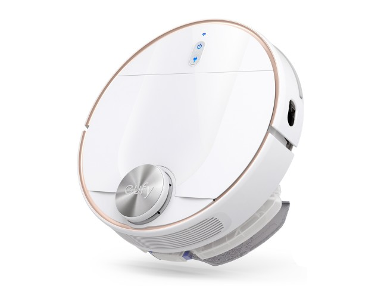
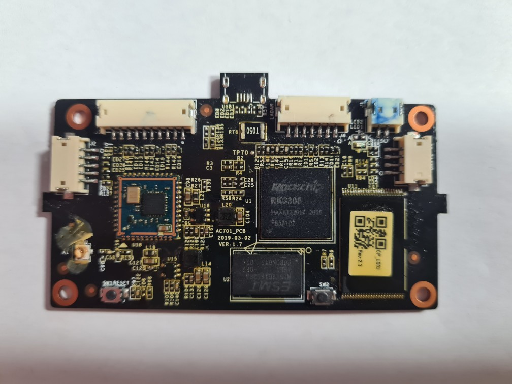
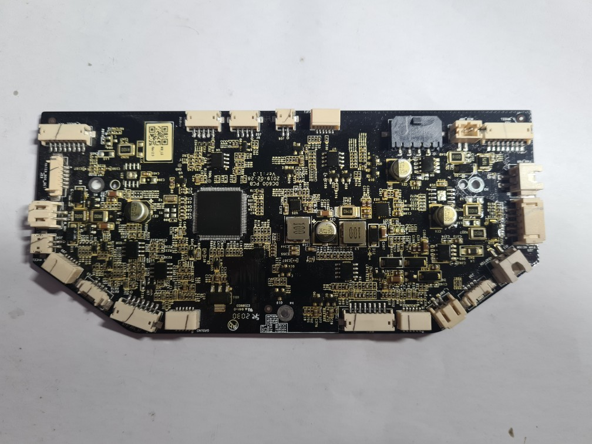

# Tetrodotoxin
Eufy L70 robot vacuum research. 



The eventual aim is to build a custom frimware using [Yocto](https://www.yoctoproject.org/ "The Yocto Project") and extend the functionality of the unit, add more storage, bt and gamepad support, also to make the unit stanalone "without the need of the eufy app and cloud network connection" . 

In its stock configuration L70 is a [tuya](https://www.tuya.com "tuya") based device using Linux firmware 
```
(Linux 4.4.143 aarch64 (gcc version 6.3.1 20170404 (Linaro GCC 6.3-2017.05))).
```

The unit comprises of two contol PCB boards and one Lidar. 
## Wifi Board

This board contains
- RockChip RK3308. 
- Realtek RTL8188F802.11b/g/n Wifi.
- EMST M15T2G16128A -2G DDR3.
- EMST F59L1G81LB - 128M NAND.
- Populated Uart2 port. 
- Two Push buttons labled 'SW1 RESET' and 'SW2'.
- A unpopulated micro-usb named USB1.
- Connection for the JOVE2 JVE-S2 Lidar.
- Connection to an external micro USB debug port. 

## Function Board 

This board contains
- GigaDevice GD32F10x Arm 32-bit MCU.
- Battery connection power disbrution and charging circuts.
- All of the units function come from this board.
- Populated five pin debug port.   
